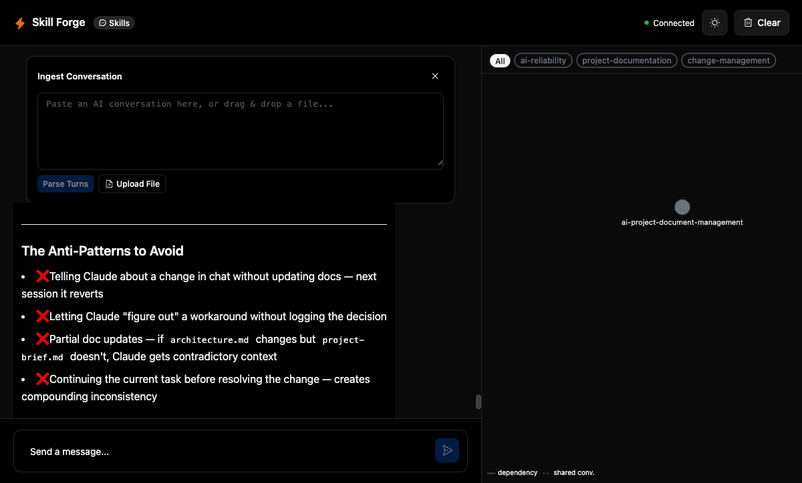
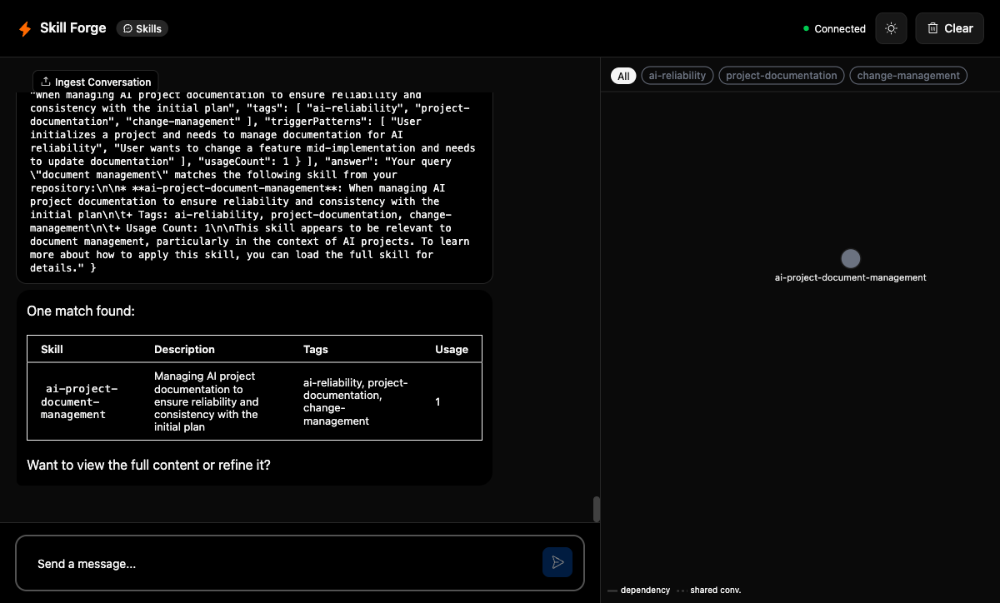
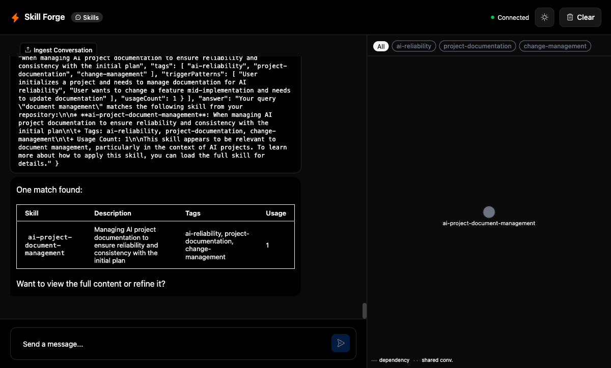
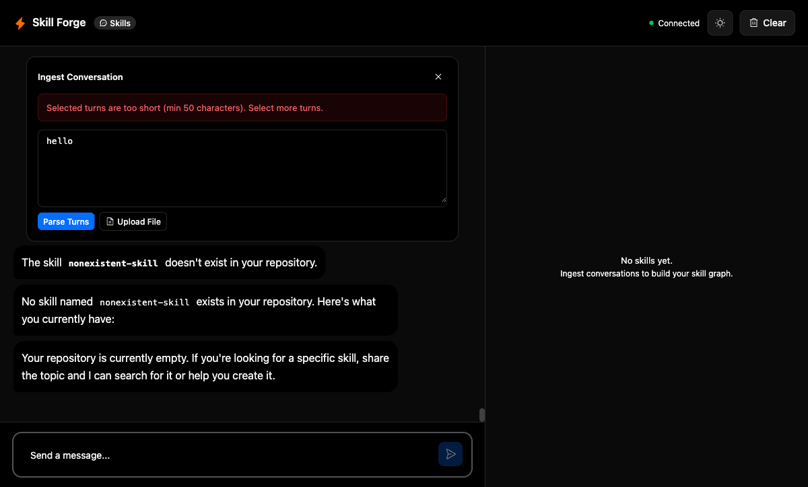

# cf_ai_skill_forge

An AI-powered skill distillation tool that transforms fragmented AI conversation history into a structured, searchable, graph-visualized skill repository — built entirely on Cloudflare's platform.

**Live Demo**: [https://agent-starter.f36meng.workers.dev](https://agent-starter.f36meng.workers.dev)

**Demo Video**: Attached in Github Repo.

## What It Does

1. **Ingest** — Paste conversation logs from Claude, ChatGPT, or Gemini, or use `/copy k` to capture the last K turns from the active chat
2. **Synthesize** — A multi-step Workflow extracts decision patterns, cross-references existing skills, and drafts a structured SKILL.md
3. **Refine** — Chat with the agent to iterate on skill descriptions, tags, and trigger patterns
4. **Visualize** — Browse your skill graph with D3 force-directed layout, filter by tag, and inspect dependencies

### Screenshots

| Ingestion Complete | Chat Tools | Graph View | Error Handling |
|---|---|---|---|
|  |  |  |  |

## Assignment Requirements

| Requirement | Implementation |
|-------------|---------------|
| **LLM** | Anthropic Claude Sonnet 4 (chat via `@ai-sdk/anthropic` + `streamText()`) + Workers AI Llama 3.3 70B (ingestion workflow via `env.AI.run()`) |
| **Workflow / Coordination** | Cloudflare Workflows (`IngestionPipeline` — 4-step LLM chain with automatic retry) + `AIChatAgent` Durable Object (WebSocket chat, tool calls, state sync) |
| **User Input via Chat** | WebSocket chat with streaming responses, 4 tool calls (`listSkills`, `viewSkill`, `searchSkills`, `refineSkill`), `/copy k` command for chat-to-ingestion flow, and a dedicated Ingestion Panel |
| **Memory / State** | Agent embedded SQLite (`this.sql`) for persistent skill storage + `setState()` for real-time graph sync across WebSocket |

## Architecture

```
┌─────────────────────────────────────────────────────┐
│  React + Vite + @cloudflare/kumo                    │
│  ┌──────────────┐  ┌────────────────────────────┐   │
│  │ Ingestion    │  │ Chat Panel                 │   │
│  │ Panel        │  │ (Streamdown + tool cards)  │   │
│  └──────┬───────┘  └────────────┬───────────────┘   │
│         │ WebSocket             │ WebSocket          │
└─────────┼───────────────────────┼───────────────────┘
          │                       │
┌─────────┴───────────────────────┴───────────────────┐
│  AIChatAgent (Durable Object)                       │
│  ┌────────────┐  ┌──────────┐  ┌─────────────────┐  │
│  │ onMessage  │  │ onChat   │  │ Embedded SQLite │  │
│  │ (ingest)   │  │ (tools)  │  │ (skills, convos)│  │
│  └─────┬──────┘  └────┬─────┘  └─────────────────┘  │
│        │              │                              │
│        ▼              ▼                              │
│  Workflow API    Anthropic SDK                       │
│  (create)        (streamText)                        │
└────────┬────────────────────────────────────────────┘
         │
┌────────▼────────────────────────────────────────────┐
│  IngestionPipeline (Workflow)                        │
│  Step 1: Extract patterns   ──► Workers AI (Llama)  │
│  Step 2: Cross-ref skills   ──► Workers AI (Llama)  │
│  Step 3: Draft SKILL.md     ──► Workers AI (Llama)  │
│  Step 4: Notify agent       ──► Agent RPC callback  │
└─────────────────────────────────────────────────────┘
```

### Tech Stack

| Layer | Technology |
|-------|-----------|
| Frontend | React 19 + Vite 7 + Tailwind v4 + `@cloudflare/kumo` |
| Agent | `AIChatAgent` from `@cloudflare/ai-chat` (Durable Object) |
| Chat LLM | Anthropic Claude via `@ai-sdk/anthropic` + Vercel AI SDK `streamText()` |
| Workflow LLM | Workers AI — `@cf/meta/llama-3.3-70b-instruct-fp8-fast` |
| Workflow | Cloudflare Workflows (`WorkflowEntrypoint`) |
| Storage | Agent embedded SQLite (`this.sql`) |
| Graph | D3.js force-directed visualization |
| Streaming | `streamdown` for markdown rendering |

## Architecture Decisions

### 1. AIChatAgent + Workflows 

The Agent handles interactive chat (streaming responses, tool calls, state sync) while the Workflow handles the multi-step ingestion pipeline. This separation matters because ingestion involves 3 sequential LLM calls that benefit from Workflow's automatic step retry and isolation — if step 2 fails, step 1 doesn't re-run. The Agent stays responsive to chat while ingestion runs in the background.

### 2. Embedded SQLite
Each user gets their own Agent instance with colocated SQLite storage. This means zero-latency reads (no network hop to D1), per-user data isolation by default, and simpler code — `this.sql` instead of managing separate D1 bindings and KV namespaces. The trade-off is no cross-user querying, which we don't need.

### 3. Separate Ingestion Panel from Chat

Conversation ingestion (paste/upload) is a different interaction pattern from chat. It's a one-shot action with progress feedback, not a back-and-forth conversation. Keeping it as a dedicated UI zone above the chat avoids polluting the chat history with ingestion artifacts and lets the user see progress while still chatting.

### 4. Anthropic for Chat, Workers AI for Workflow

Chat requires high-quality tool use and streaming — Anthropic Claude excels at both. The ingestion Workflow runs structured extraction prompts where Llama 3.3 70B performs well and runs natively on Cloudflare's infrastructure with no external API dependency or latency. This dual-LLM approach optimizes for both quality and cost.

## Setup & Run

```bash
# Clone and install
cd agents-starter
npm install

# Authenticate with Cloudflare (required for Workers AI binding)
npx wrangler login

# Create .dev.vars with your API key and model
cat > .dev.vars << 'EOF'
ANTHROPIC_API_KEY=your-key-here
MODEL=claude-sonnet-4-6
EOF

# Start development server
npm run dev
```

Open [http://localhost:5173](http://localhost:5173).

### Quick Test

1. Chat: *"When user initialize a project, how to manage the document to make AI reliable?"*
2. Wait for response, then type `/copy 1`
3. Ingestion Panel opens pre-filled — click **Parse Turns** → **Extract Skill** → **Approve & Save**
4. Graph updates with the new skill node

## Project Structure

```
agents-starter/
  src/
    server.ts              # AIChatAgent: chat, tools, ingestion, state management
    workflow.ts            # IngestionPipeline: extract → crossref → draft → notify
    workflow-helpers.ts    # Shared utilities for workflow steps
    prompts.ts             # LLM prompt templates (extract, crossref, draft, refine, search)
    types.ts               # Domain types (SkillForgeState, SkillMetadata, messages)
    graph.ts               # computeGraphData() — builds nodes/edges from skills
    app.tsx                # Two-panel layout: Ingestion+Chat | Graph+Preview
    client.tsx             # React DOM mount
    styles.css             # Tailwind v4 + kumo imports
    components/
      IngestionPanel.tsx   # Paste/upload conversations + progress display
      GraphView.tsx        # D3 force-directed skill graph with zoom/drag/filter
      SkillPreview.tsx     # Skill detail view (tags, metadata, dependencies)
      ToolPartView.tsx     # Tool call/result rendering in chat
      ThemeToggle.tsx      # Dark/light mode toggle
```

## Testing

**Unit tests** — 81 tests via Vitest:

```bash
cd agents-starter
npx vitest run
```

**Integration tests** — Playwright MCP automation against `localhost:5173`. Results and screenshots in [`screenshots/`](screenshots/):

| Test | Status |
|------|--------|
| IT-1: Ingestion E2E (`/copy 2` → parse → extract → approve) | PASS |
| IT-2: Chat Tools (listSkills, viewSkill, searchSkills) | PASS |
| IT-3: Graph State Sync (node click, preview, back) | PASS |
| IT-5: Persistence (refresh → skills + chat restored) | PASS |
| IT-3.5: Delete Skill (node removed from graph) | PASS |
| IT-6: Error Resilience (short input, nonexistent skill) | PASS |

## AI Prompts

See [PROMPTS.md](PROMPTS.md) for all LLM prompts used in the application and the development process.

## License

MIT
